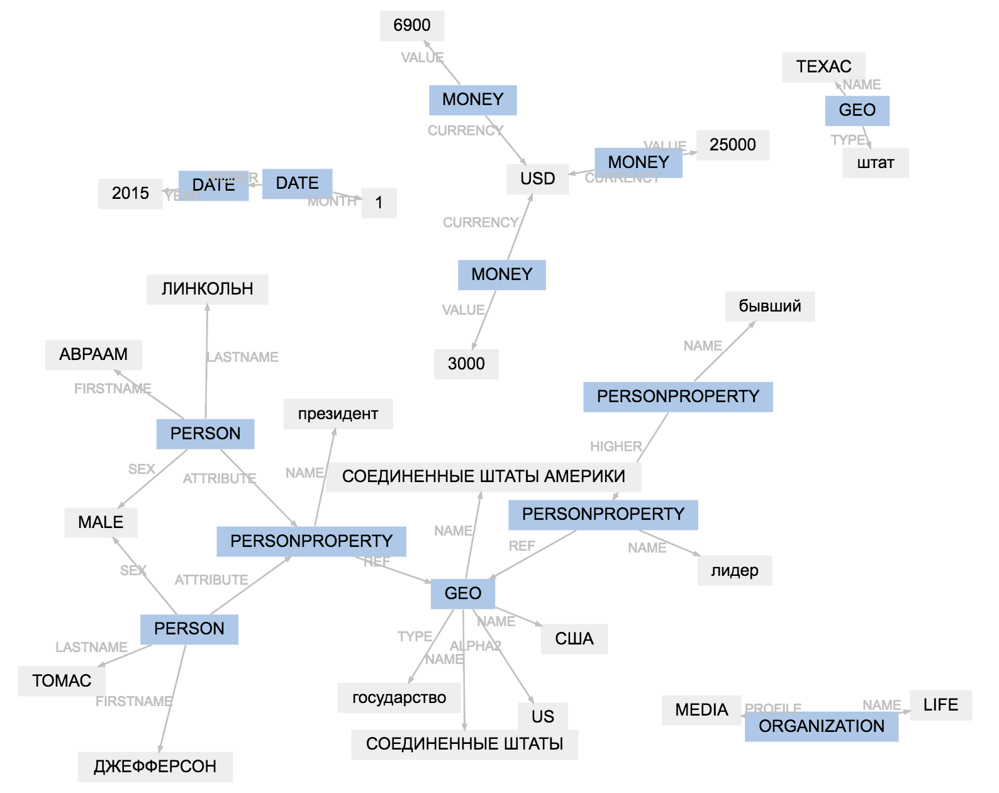

# pullenti-wrapper [](https://travis-ci.org/pullenti/pullenti-wrapper)

[PullEnti](http://pullenti.ru/) — библиотека на C# для NER на русском языке. В 2016 году заняла первое место на [соревновании factRuEval-2016](https://github.com/dialogue-evaluation/factRuEval-2016). В 2018 автор [портировал код на Java и Python](https://habr.com/post/354942/).

Плюсы PullEnti:
- Наверное, лучше качество NER для русского языка. Отличная точность, нормальная полнота. 100% лучшее доступное для Python решение для NER для русского.
- Много встроенных сущностей. Не только базовые `PERSON`, `ORG`, `GEO`, но ещё `DATE`, `MONEY`, `PHONE`, `ADDRESS` и ~10 других.
- Очень подробный разбор. Например, для фразы "руководителю Гринписа Ивану Залесову" пользователь получит должность, огранизацию, отдельно имя и фамилию, всё в нормальной форме.
- Кроме русского есть английский, украинский языки.
- Не зависит от других библиотек, не нужны большие модели, словари для использования.

Минусы:
- Некоммерческое использование.
- Медленно работает в Python. Инициализируется ~20 секунд, текст одной новости с lenta.ru разбирается ~2 секунды.
- Не очень привычный для Python интерфейс. Код получается трансляцией из C#.
- Очень сложный код. Тяжело понять, что пошло не так есть, если в результате ошибка.

Библиотека pullenti-wrapper нужна, чтобы исправить проблемы с интерфейсом. Концептуально ничего не меняется, API просто немного более лаконичное, у результатов разбора добавлен нормальный `__repr__`.


## Использование

```python
from pullenti_wrapper.processor import (
    Processor,
    DATE,
    GEO,
    ORGANIZATION,
    PERSON,
    MONEY,
)

processor = Processor([PERSON, ORGANIZATION, GEO, DATE, MONEY])
text = '...'
result = processor(text)
display(result)
```
```
В США прядь волос третьего президента Соединенных Штатов Томаса 
  GEO                      PERSONPROPERTY---------------        
                           PERSON-------------------------------
                                      GEO---------------        
Джефферсона продали на аукционе в Техасе за 6,9 тысячи долларов, 
                                  GEO---    MONEY--------------  
-----------                                                      
передает Life. Локоны бывшего лидера США ушли с молотка почти через 
         ORGA         PERSONPROPERTY----                            
                                     GEO                            
190 лет после его смерти. Их покупатель пожелал остаться неизвестным. 
Перед началом аукциона волосы Джефферсона оценивали в 3 тысячи 
                              PERSON-----             MONEY----
долларов. В январе 2015 года прядь волос 16-го президента США Авраама 
--------    DATE------------                   PERSONPROPERTY         
                                               PERSON-----------------
                                                          GEO         
Линкольна продали за 25 тысяч долларов на аукционе в Далласе.
                     MONEY------------                       
---------                                                 

```



## Установка

pullenti-wrapper поддерживает Python 3.4+ и PyPy 3.

```bash
$ pip install pullenti-wrapper
```

## Документация

- Документация для обёртки — http://nbviewer.jupyter.org/github/pullenti/pullenti-wrapper/blob/master/docs.ipynb
- Документация для PullEnti — http://pullenti.ru/DownloadPage.aspx. На сайте PullEnti также есть демо-стенд http://pullenti.ru/DemoPage.aspx

## Лицензия

Для pullenti-wrapper — MIT, для PullEnti — Free for non-commercial use, подробности на http://pullenti.ru/

## Поддержка

Для обёртки:
- Чат — https://telegram.me/natural_language_processing
- Тикеты — https://github.com/pullenti/pullenti-wrapper/issues

Для PullEnti — http://www.pullenti.ru/Default.aspx

## Разработка

Обновить версию pullenti, pullenti-client в requirements.txt.

Тесты:

```bash
make test
```

Пакет:

```bash
make version
git add ...
git commit -m 'Up version'

make tag
git push
git push --tags

make clean wheel upload
```
